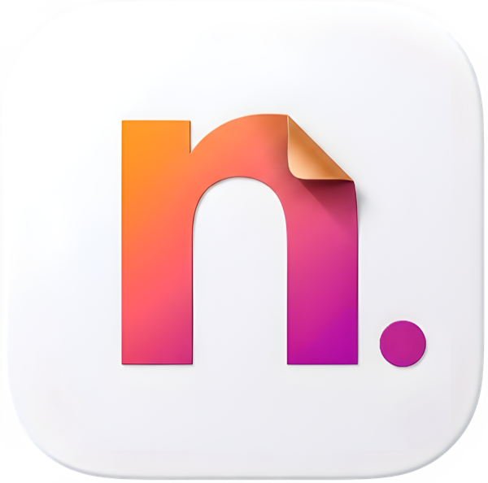
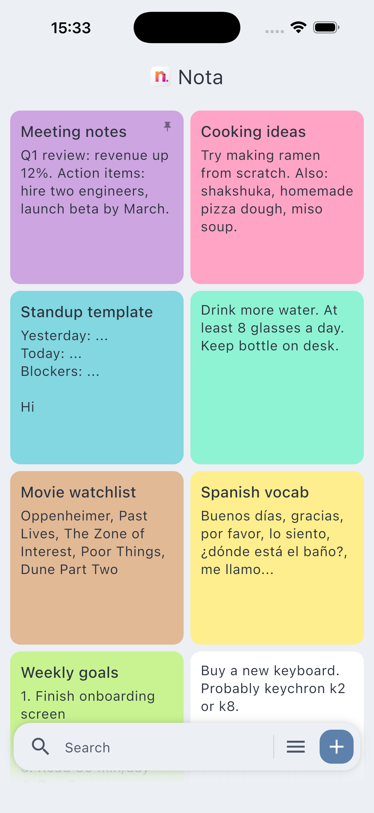
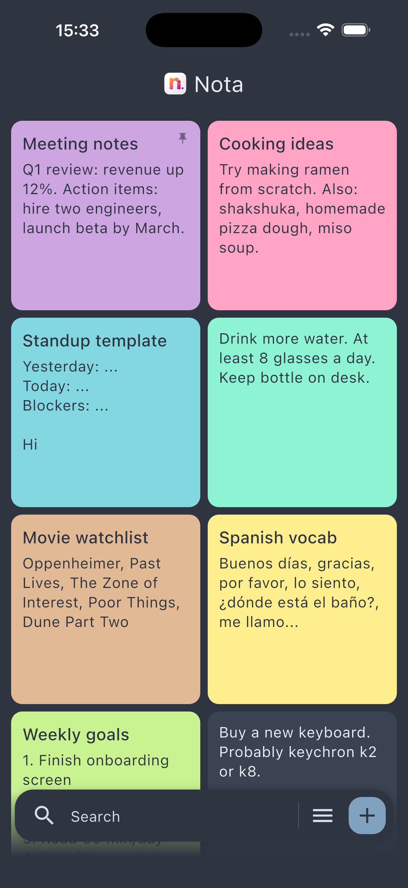
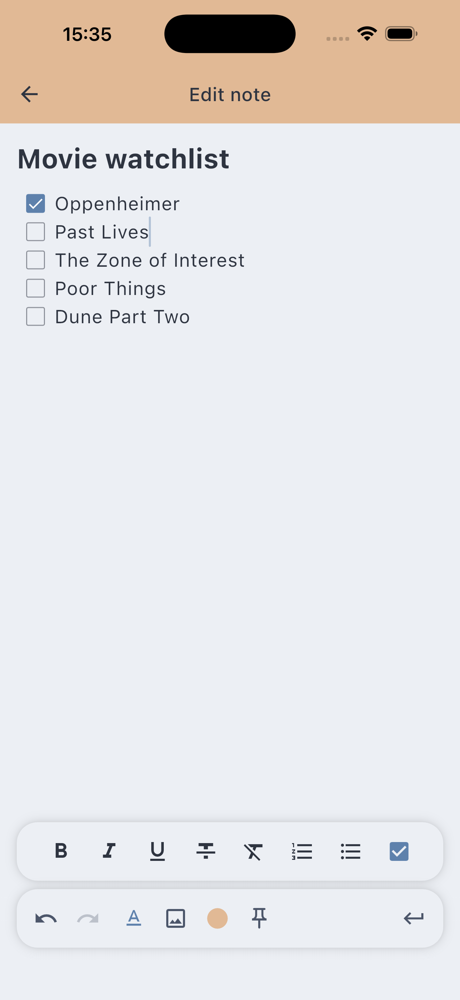
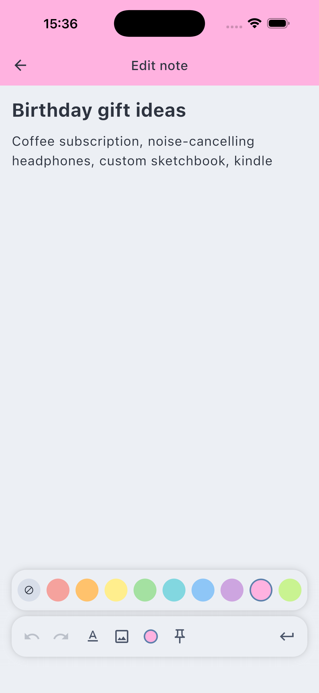
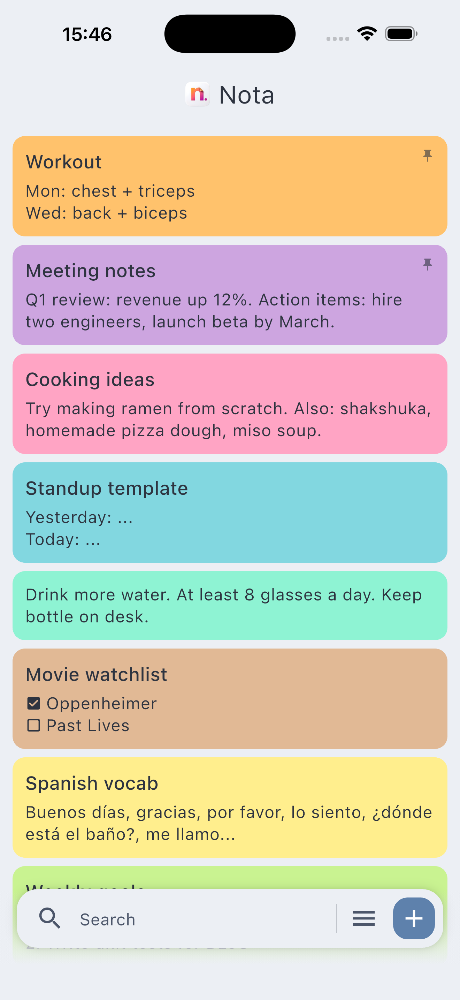
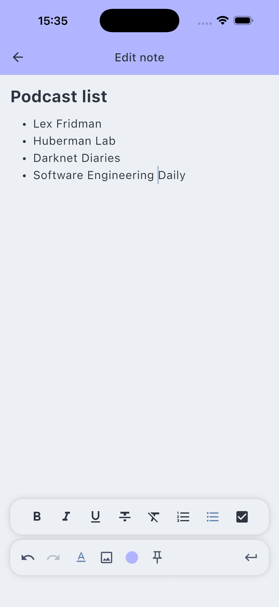
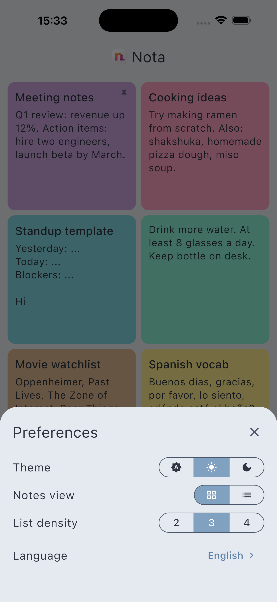
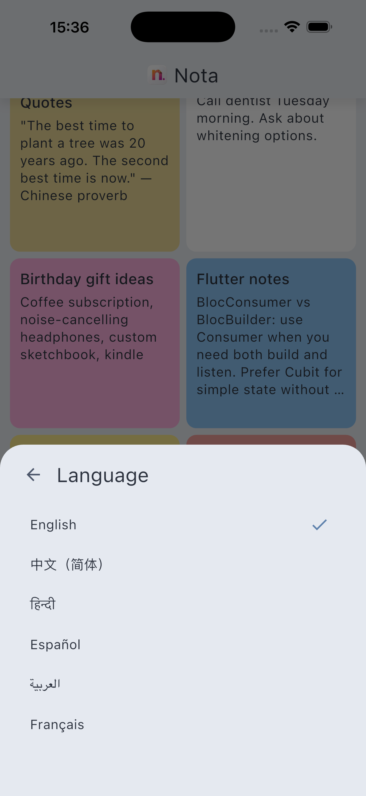

<h1 align="center">
  
  <br/>Nota
</h1>

<p align="center">A minimalist, local-first note-taking app for iOS and Android.</p>

## Screenshots

<table>
  <tr>
    <td align="center"><b>Note list · Light</b></td>
    <td align="center"><b>Note list · Dark</b></td>
    <td align="center"><b>Rich text editor</b></td>
    <td align="center"><b>Color picker</b></td>
  </tr>
  <tr>
    <td></td>
    <td></td>
    <td></td>
    <td></td>
  </tr>
  <tr>
    <td align="center"><b>List view</b></td>
    <td align="center"><b>Bullet lists</b></td>
    <td align="center"><b>Preferences</b></td>
    <td align="center"><b>10 languages</b></td>
  </tr>
  <tr>
    <td></td>
    <td></td>
    <td></td>
    <td></td>
  </tr>
</table>

## Features

**Notes**
- Rich text editor — bold, italic, underline, strikethrough
- Ordered lists, bullet lists, checklists
- Embed images from the gallery
- 16 note colors
- Pin important notes to the top
- Search across all notes

**Note list**
- Grid and list view modes
- Adjustable list density (2 / 3 / 4 lines of preview)
- Multi-select and batch delete

**Customization**
- Light, dark, and system theme (Nord palette)
- 10 interface languages: English, Russian, Spanish, French, German, Portuguese, Japanese, Chinese, Hindi, Arabic

**Privacy**
- Fully local — no account, no cloud, no analytics
- Works completely offline

## Tech stack

| Layer | Technology |
|---|---|
| UI | Flutter, flutter_quill |
| State | flutter_bloc (BLoC / Cubit) |
| Navigation | go_router |
| Storage | Drift (SQLite) |
| Architecture | Feature-based monorepo |

## Dependencies

| Package | Purpose |
|---|---|
| [flutter_quill](https://pub.dev/packages/flutter_quill) | Rich text editor |
| [flutter_bloc](https://pub.dev/packages/flutter_bloc) | State management |
| [go_router](https://pub.dev/packages/go_router) | Navigation |
| [drift](https://pub.dev/packages/drift) | SQLite ORM |
| [sqlite3_flutter_libs](https://pub.dev/packages/sqlite3_flutter_libs) | SQLite native binaries |
| [shared_preferences](https://pub.dev/packages/shared_preferences) | Persistent key-value storage |
| [toastification](https://pub.dev/packages/toastification) | In-app toast notifications |
| [image_picker](https://pub.dev/packages/image_picker) | Pick images from gallery |
| [smart_keyboard_insets](https://pub.dev/packages/smart_keyboard_insets) | Smooth keyboard inset handling |
| [path_provider](https://pub.dev/packages/path_provider) | App document directory |
| [package_info_plus](https://pub.dev/packages/package_info_plus) | App version info |
| [equatable](https://pub.dev/packages/equatable) | Value equality |
| [bloc_concurrency](https://pub.dev/packages/bloc_concurrency) | Event transformers |
| [uuid](https://pub.dev/packages/uuid) | UUID generation |
| [intl](https://pub.dev/packages/intl) | Localizations |

## Project structure

```
lib/                        # App shell, routing, DI
packages/
  shared/                   # Domain models, repository interfaces
  note_repository/          # SQLite persistence (Drift)
  preferences_service/      # User preferences
  component_library/        # Theme, design tokens, shared widgets
  image_files/              # Note image file management
  features/
    note_list/              # Note list screen
    note_details/           # Note editor screen
    preferences_menu/       # Settings bottom sheet
```

## Requirements

- Flutter 3.41+
- Dart 3.11+
